# Punish for goal difference
Experiment Date: 31 March 2021, Time: 20:39 
## What is the experiment about
in each step calculate the difference of the current state to the goal state.
Normalize, multiply with -1 and use as punishment on each step.
Give positive reward only when target and correct heading is reached.

No curriculum learning was used

fixed threshold for runway difference to 10°

# corresponding branch 
experiment_shaped_rewards_sin_cos

commit: 

# Observation function:
```
aircraft_position = self.sim.get_aircraft_geo_position()

bearing_to_target_deg = aircraft_position.true_bearing_deg_to(destination=self.target_position)
current_distance_to_target_m = aircraft_position.distance_haversine_km(self.target_position) * 1000
max_possible_travelled_distance_m = self.aircraft.get_max_distance_m(episode_time_s=self.max_episode_time_s)

#localizer_error_deg = utils.get_angle_difference_deg(current_deg=qdm_angle_deg, target_deg=p_AB_N.azimuth_deg)

bearing_to_target_norm = np.interp(math.radians(bearing_to_target_deg), [0, 2*np.pi], [-1, 1])
current_distance_to_target_norm = np.interp(current_distance_to_target_m, [0, max_possible_travelled_distance_m], [-1, 1])
runway_angle_error_deg = utils.reduce_reflex_angle_deg(self.sim.get_heading_true_deg() - self.runway_angle_deg)
runway_angle_error_norm = np.interp(runway_angle_error_deg, [-180, 180], [-1, 1])

return np.array([
    math.sin(math.radians(bearing_to_target_deg)),
    math.cos(math.radians(bearing_to_target_deg)),
    current_distance_to_target_norm,
    math.sin(math.radians(runway_angle_error_deg)),
    math.cos(math.radians(runway_angle_error_deg))
], dtype=np.float32)
```

# Reward function:
```
    def _reward(self):
        reward_bounds = 0
        if self.sim.is_aircraft_out_of_bounds(self.max_distance_km):
            reward_bounds = -10

        reward_target_reached = 0
        reward_distance = 0

        if self.sim.is_aircraft_at_target(min_distance_to_target=self.target_radius_km,
                                          target_position=self.target_position):
            runway_angle_error_deg = utils.reduce_reflex_angle_deg(self.sim.get_heading_true_deg() - self.runway_angle_deg)
            if abs(runway_angle_error_deg) < self.runway_angle_threshold_deg:
                print(">>>>>>>>>>>>>>>> error_deg", runway_angle_error_deg)
                reward_target_reached = 10
                print(f"Episode: {self.episode_counter}, "
                      f"runway angle: {self.runway_angle_deg}, "
                      f"heading: {self.sim.get_heading_true_deg()}")
                # self.runway_angle_threshold_deg -= 1
                # if self.runway_angle_threshold_deg < self.min_runway_angle_threshold_deg:
                #     self.runway_angle_threshold_deg = self.min_runway_angle_threshold_deg
                print("new self.runway_angle_threshold_deg", self.runway_angle_threshold_deg)
            # else:
            #     reward_target_reached = - np.interp(abs(runway_angle_error_deg), [0, 180], [0, 1])
        aircraft_position = self.sim.get_aircraft_geo_position()
        current_distance_to_target_km = aircraft_position.distance_haversine_km(self.target_position)
        # reward_distance = -current_distance_to_target_km / 100
        max_possible_travelled_distance_m = self.aircraft.get_max_distance_m(episode_time_s=self.max_episode_time_s)
        current_distance_to_target_norm = np.interp(current_distance_to_target_km * 1000,
                                                    [0, max_possible_travelled_distance_m], [-1, 1])
        runway_angle_error_deg = utils.reduce_reflex_angle_deg(self.sim.get_heading_true_deg() - self.runway_angle_deg)
        runway_angle_error_norm = np.interp(runway_angle_error_deg, [-180, 180], [-1, 1])

        achieved_goal = np.array([
            current_distance_to_target_norm,
            runway_angle_error_norm
        ], dtype=np.float32)

        desired_goal = np.array([
            np.interp(0, [0, max_possible_travelled_distance_m], [-1, 1]),
            np.interp(0, [-180, 180], [-1, 1])
        ], dtype=np.float32)

        reward_distance = - abs(np.linalg.norm(achieved_goal - desired_goal, axis=-1))

        reward = reward_target_reached  + reward_bounds + reward_distance

        print("reward", reward)

        assert not math.isnan(reward)

        return reward
```

# Algorithm
## Used Algorithm
SAC 
## Used Framework
SB3
## Algorithm Hyperparams
```
model = SAC("MlpPolicy",
            env,
            learning_rate=float(3e-4),
            buffer_size=50000,
            gamma=0.99,
            tau=0.01,
            gradient_steps=int(1),
            batch_size=64,
            learning_starts=10000,
            train_freq=1,
            verbose=1,
            tensorboard_log="./data/results")
```


# Corresponding Commit(s)


# Results 
Number of episodes: 1260
Number of steps: 


### Example images in the end of training (10)
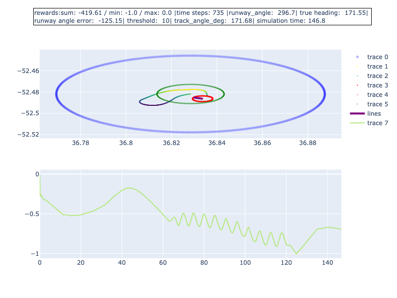
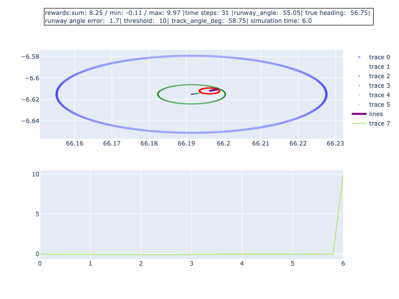
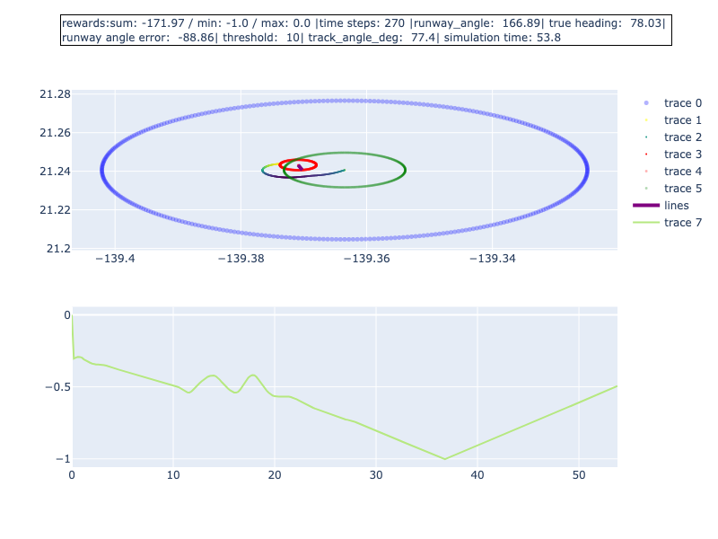
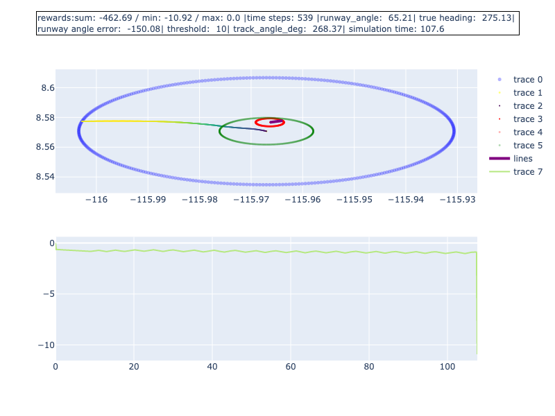
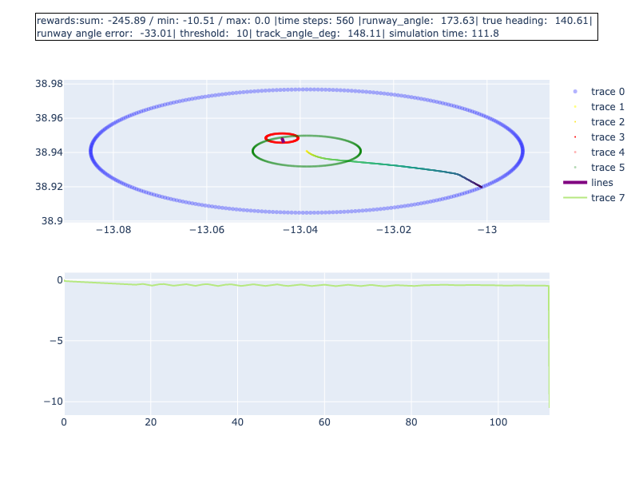
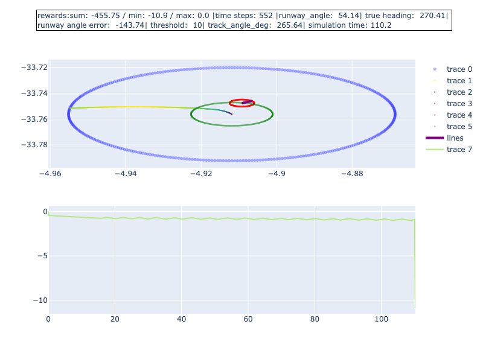
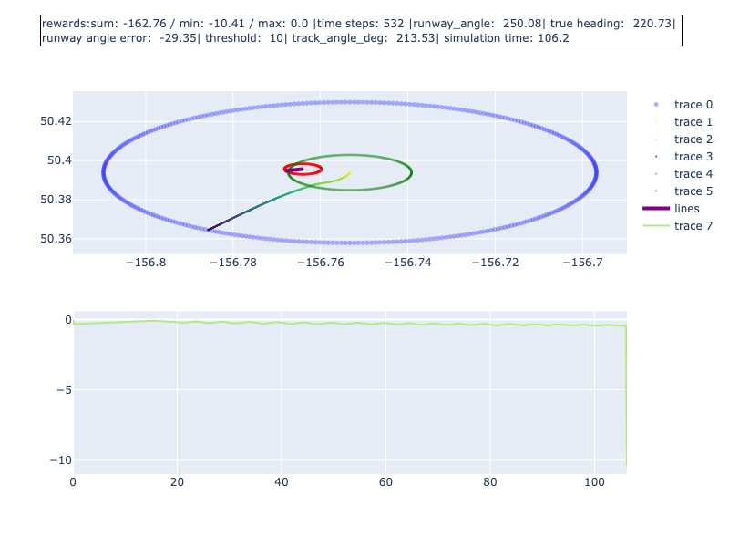

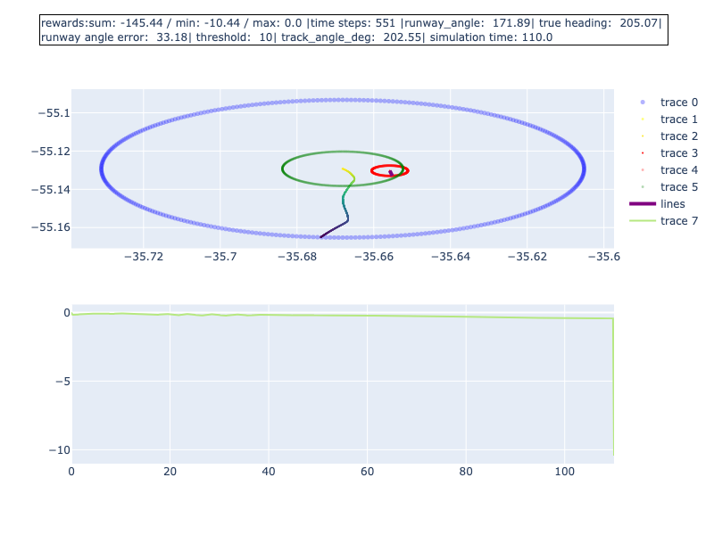
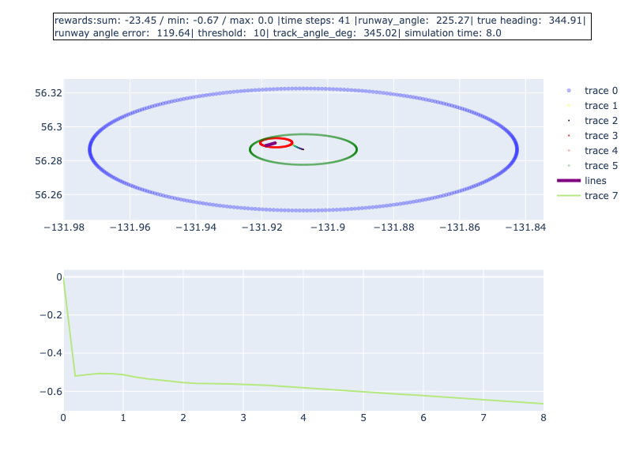
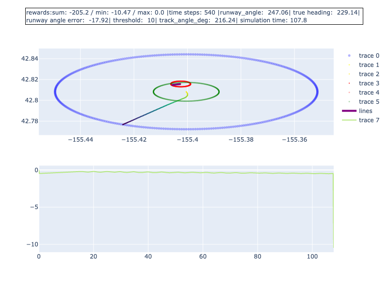


### Description
Reward increases but target is not hit... heading even less
Circular movement...

### Graph for all seeds
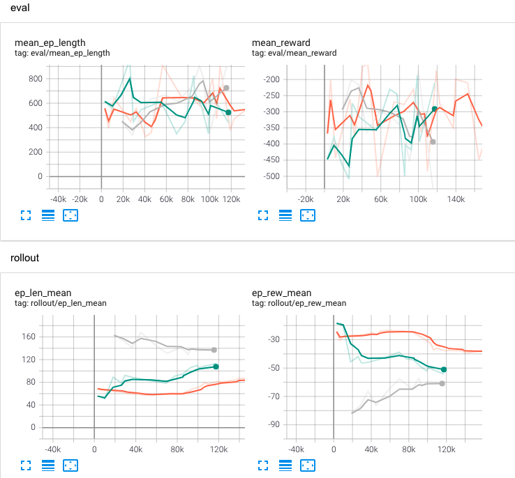


## Conclusion Description
- Seems to add circles to flight... circular movements like sines. See picture

# Next Steps
-- 