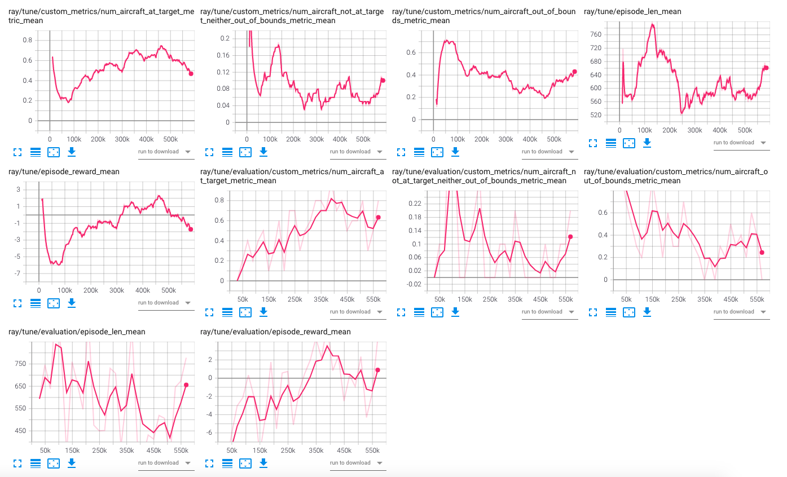

# Date: 18.03

steps: 580k

at target:
- For runway angle: if > 1° then -angle difference in radians  else reward is 0
- For getting to target: 10
- For getting out of bounds: -10

### Results
Does seem to have a bad time learning...

Tensorboard:

